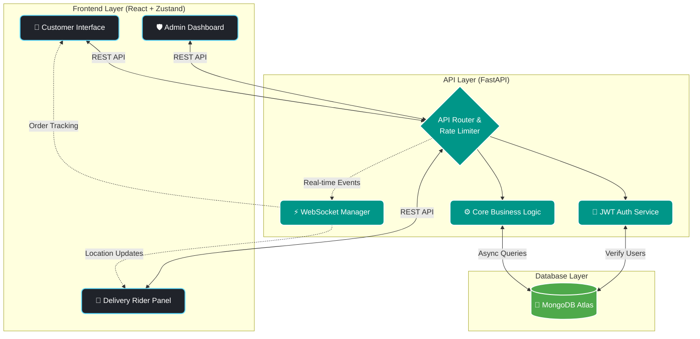
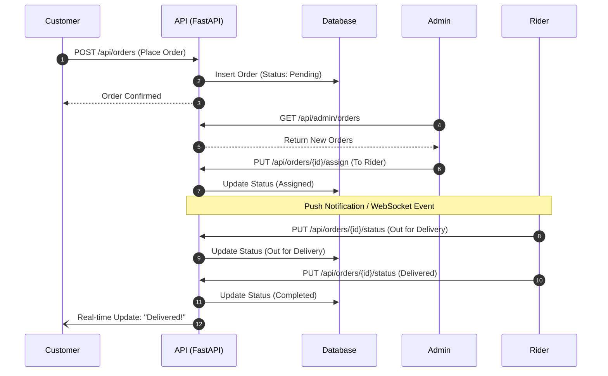

<div align="center">
  

  <h1 align="center">🛒 Grocery Commerce Platform</h1>

  <p align="center">
    <strong>A Premium, Enterprise-Grade, Full-Stack Grocery Delivery & Management Solution</strong>
  </p>

  <p align="center">
    <a href="https://grocery-commerce-platform.onrender.com"><strong>Live Frontend Demo</strong></a>
    ·
    <a href="https://grocery-commerce-platform.onrender.com/docs"><strong>Live API Swagger Docs</strong></a>
    ·
    <a href="#-installation--setup"><strong>Quick Start</strong></a>
  </p>

  <p align="center">
    
  </p>

  <!-- Status & Build Badges -->
  <p align="center">
    
    
    
    
  </p>
  
  <!-- Tech Stack Badges -->
  <p align="center">
    
    
    
    
    
  </p>
</div>

<br />

> 🚧 **CURRENT DEVELOPMENT STATUS:** This project is actively evolving. Core functionalities for consumers, admins, and riders are operational and deployed, but UI optimizations, WebSocket enhancements, and advanced analytics are being deployed continuously.

---

## 📊 System Architecture & Data Flow

<div align="center">



</div>

### 🔄 End-to-End Order Lifecycle



---

## 🎯 Project Overview

The **Grocery Commerce Platform** is a complete, decoupled SaaS-style web application architected to digitize local and mid-scale grocery operations. 

Traditional off-the-shelf e-commerce templates often fail to handle the three-sided marketplace required for grocery delivery: **Consumers, System Admins, and Delivery Riders**. This platform solves that problem by providing dedicated, highly optimized interfaces and automated workflows for all three entities. 

Built with an incredibly fast **Python FastAPI** backend and a reactive **React + Zustand** frontend, it ensures sub-second response times, secure data handling, and an uncompromising modern user experience.

---

## 🌐 Live Deployments

The application is deployed securely to production edge networks.

*   **Frontend (Vercel):** [Visit Customer Web App](https://grocery-commerce-platform.vercel.app/) *(Insert actual Vercel URL)*
*   **Backend API (Render):** [Visit API / Swagger Docs](https://grocery-commerce-platform.onrender.com/docs)
*   **Database:** Hosted globally via MongoDB Atlas.

---

## ✨ Core Features

We have built real, functional modules strictly adhering to modern e-commerce requirements.

### 🛍️ Consumer Features
- **JWT Authentication:** Secure user registration, login, and session persistence.
- **Dynamic Catalog:** Browse products, advanced filtering, and structured category navigation.
- **Cart & Wishlist State:** Handled natively via Zustand for instant UI updates.
- **Frictionless Checkout:** Multi-step order placement processing.
- **Order Tracking:** Detailed historical and active order views.
- **Product Reviews:** Users can leave ratings and text reviews for purchased items.

### 🛡️ Administrative Controls (`/admin`)
- **Master Dashboard:** High-level system metrics and revenue analytics.
- **Product & Category CRUD:** Complete control over store inventory and metadata.
- **Order Management:** View incoming orders and seamlessly assign them to available delivery partners.
- **Coupon System:** Generate, manage, and validate promotional discount codes.
- **User & Rider Oversight:** Manage customer accounts and approve/track delivery riders.
- **System Settings:** Dynamically update platform variables.

### 🛵 Delivery Partner Portal (`/delivery`)
- **Rider Dashboard:** Specialized UI strictly for authenticated delivery personnel.
- **Active Deliveries:** View assigned orders, pickup details, and customer routing info.

### ⚙️ System Capabilities
- **WebSockets (`/ws`):** Infrastructure in place for real-time order status tracking.
- **Rate Limiting:** IP-based request throttling using `SlowAPI` to prevent DDoS.
- **Data Validation:** Strict schema enforcement via `Pydantic`.

---

## 🛠️ Technology Stack

Our stack was deliberately chosen for **speed, type-safety, and rapid iteration**.

### 💻 Frontend Architecture
| Technology | Role |
| :--- | :--- |
| **React 18** | Core UI rendering engine |
| **Vite** | Blazing fast build tool and dev server |
| **Tailwind CSS v4** | Utility-first styling for premium responsive design |
| **Zustand** | Lightweight, boilerplate-free global state management |
| **React Router v6** | Client-side routing and layout management |
| **Axios** | Promise-based HTTP client with custom interceptors |
| **Lucide React** | Beautiful, clean iconography |

### ⚙️ Backend Architecture
| Technology | Role |
| :--- | :--- |
| **Python 3** | Core runtime |
| **FastAPI** | Ultra-high performance async API framework |
| **Uvicorn** | ASGI web server implementation |
| **PyJWT & Bcrypt** | Secure stateless authentication and password hashing |
| **Pydantic** | Unyielding data validation and serialization |
| **SlowAPI** | Robust rate-limiting middleware |

### 🗄️ Database & Hosting
| Technology | Role |
| :--- | :--- |
| **MongoDB Atlas** | Fully managed cloud NoSQL database |
| **Motor** | Asynchronous Python driver for MongoDB |
| **Vercel** | Edge network frontend hosting |
| **Render** | Automated backend continuous deployment |

---

## 🏗️ System Architecture & Flow

### Request Flow
1. **Client Action:** React state changes via Zustand triggers an Axios API call.
2. **Interception:** Axios interceptor automatically injects the Bearer JWT token.
3. **Gateway:** FastAPI receives the request; `CORS` and `SlowAPI` middleware validate the origin and rate limits.
4. **Validation:** `Pydantic` models validate the incoming payload.
5. **Controller/Service:** Business logic processes the request and calls `Motor` to interact with MongoDB.
6. **Response:** Data is returned asynchronously and instantly reflected in the React UI.

### Folder Structure
```text
grocery-commerce-platform/
├── frontend/
│   ├── src/
│   │   ├── api/               # Axios instances & interceptors
│   │   ├── components/        # Reusable UI cards, buttons, modals
│   │   ├── pages/             # Route views (Home, Cart, Checkout)
│   │   │   └── admin/         # Protected Admin dashboard views
│   │   └── App.jsx            # Routing configuration
│   ├── package.json
│   └── tailwind.config.js
│
└── backend/
    ├── app/
    │   ├── config.py          # Environment configuration
    │   ├── database/          # MongoDB Motor connection
    │   ├── models/            # Pydantic schemas (Product, User, Order)
    │   ├── routes/            # API Endpoints (auth_router, admin_router)
    │   ├── services/          # Core business logic
    │   ├── utils/             # Helpers (limiter, auth logic)
    │   └── main.py            # FastAPI application entry point
    └── requirements.txt
```

---

## 🔐 Authentication & Security

Security is integrated at the architectural level:
- **Stateless JWT:** Tokens are issued upon login and validated via FastAPI dependency injection on protected routes.
- **Password Encryption:** Raw passwords never touch the database; they are immediately hashed using `bcrypt` via `passlib`.
- **Role-Based Access Control (RBAC):** Routes and UI components are strictly conditionally rendered based on user roles (`customer`, `admin`, `delivery_partner`).
- **Endpoint Throttling:** `SlowAPI` prevents brute-force login attempts and endpoint spamming.

---

## 🚀 Installation & Setup

Want to run this locally? Follow these steps.

### 1. Clone the Repository
```bash
git clone https://github.com/charitarth2636/grocery-commerce-platform.git
cd grocery-commerce-platform
```

### 2. Backend Setup (FastAPI)
```bash
cd backend

# Create a virtual environment
python -m venv venv

# Activate virtual environment
# On Windows:
venv\Scripts\activate
# On Mac/Linux:
source venv/bin/activate

# Install dependencies
pip install -r requirements.txt

# Start the server (runs on http://localhost:8000)
uvicorn app.main:app --reload
```

### 3. Frontend Setup (React/Vite)
```bash
# Open a new terminal
cd frontend

# Install dependencies
npm install

# Start the development server (runs on http://localhost:5173)
npm run dev
```

---

## 🔑 Environment Variables

To run this project, you will need to add the following environment variables. Do not commit these files to version control.

### `backend/.env`
```env
# Server
HOST=0.0.0.0
PORT=8000
NODE_ENV=development

# Database
MONGODB_URI=mongodb+srv://<user>:<password>@cluster.mongodb.net/grocery_db

# Authentication
JWT_SECRET=your_super_secret_cryptographic_key
JWT_EXPIRE_MINUTES=1440

# Security
CORS_ORIGINS=["http://localhost:5173", "https://yourfrontend.vercel.app"]
```

### `frontend/.env`
```env
# Point this to your backend URL (Must include /api)
VITE_API_URL=http://localhost:8000/api
```

---

## 🗃️ Database Structure (MongoDB)

Our NoSQL architecture allows for high scalability and rapid iteration. Core collections include:
*   `users`: Stores credentials, roles, and profile data.
*   `products`: Stores item metadata, pricing, stock levels, and image URLs.
*   `categories`: Defines the hierarchy and taxonomy of the catalog.
*   `orders`: Relational document storing customer ID, assigned rider ID, item arrays, and financial totals.
*   `coupons`: Stores discount codes, expiration dates, and usage limits.
*   `wishlists`: Stores user-specific saved items.

---

## 🤝 Contributing

Contributions make the open-source community an amazing place to learn, inspire, and create. Any contributions you make are **greatly appreciated**.

1. Fork the Project
2. Create your Feature Branch (`git checkout -b feature/AmazingFeature`)
3. Commit your Changes (`git commit -m 'Add some AmazingFeature'`)
4. Push to the Branch (`git push origin feature/AmazingFeature`)
5. Open a Pull Request

---

## 📄 License

This project is distributed under the MIT License. See the `LICENSE` file for more information.

---

## ✉️ Author & Contact

**Charitarth**  
[](https://github.com/charitarth2636) 
[](https://www.linkedin.com/in/charitarth-zinzuwadiya-86ab6533a/) 

**Project Link:** [https://github.com/charitarth2636/grocery-commerce-platform](https://github.com/charitarth2636/grocery-commerce-platform)

---

<div align="center">
  
  <p><strong>Crafted with ❤️ for the Open Source Community</strong></p>
  <p><i>Building the future of modern e-commerce, one commit at a time.</i></p>
</div>
